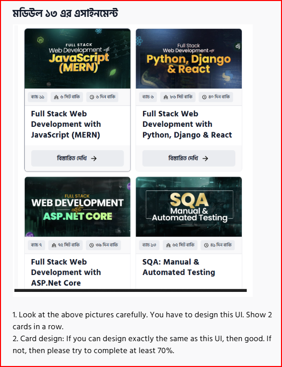
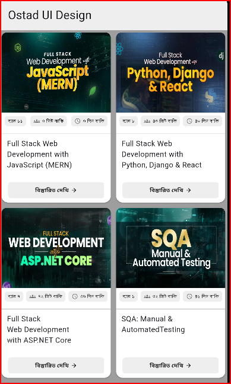

# Ostad UI Design Part 2

This repository contains assignments and exercises focused on Flutter UI design as part of the Ostad course series. The project demonstrates various layout techniques, widget implementations, and best practices for building modern mobile interfaces.

## Table of Contents

- [About the Project](#about-the-project)
- [Features](#features)
- [Getting Started](#getting-started)
- [Screenshots](#screenshots)
- [Technologies Used](#technologies-used)
- [Contributing](#contributing)
- [License](#license)

## About the Project

This project is a continuation of the Ostad UI Design curriculum. It showcases practical implementations of UI components, custom layouts, and themes in Flutter. The goal is to help learners strengthen their UI skills and apply advanced design patterns in real-world applications.

## Assignment Task (Done)


This was the assignment for Module 13:  
You had to design the UI shown above with 2 cards in each row and try to match the design at least 70%.

## My Completed Work


Above is my implementation of the assignment task UI in Flutter.

## Features

- Multiple screens demonstrating different UI patterns
- Custom widgets and reusable components
- Responsive design for different device sizes
- Use of Flutter's Material and Cupertino widgets
- Organized code structure for scalability

## Getting Started

To run this project locally:

1. **Clone the repository:**
    ```bash
    git clone https://github.com/Fahim-Mahtab/Ostad_Ui_Design_Part_2.git
    ```
2. **Navigate to the project directory:**
    ```bash
    cd Ostad_Ui_Design_Part_2
    ```
3. **Install dependencies:**
    ```bash
    flutter pub get
    ```
4. **Run the app:**
    ```bash
    flutter run
    ```

## Screenshots

<!-- Add screenshots of your app UI below -->
<!--  -->
<!--  -->

## Technologies Used

- [Flutter](https://flutter.dev/)
- [Dart](https://dart.dev/)
- Material Design
- Cupertino Design

## Contributing

Contributions, suggestions, and improvements are welcome! Please open an issue or submit a pull request for any changes.

## License

Distributed under the MIT License. See [LICENSE](LICENSE) for more information.

---

**Happy Coding!**

